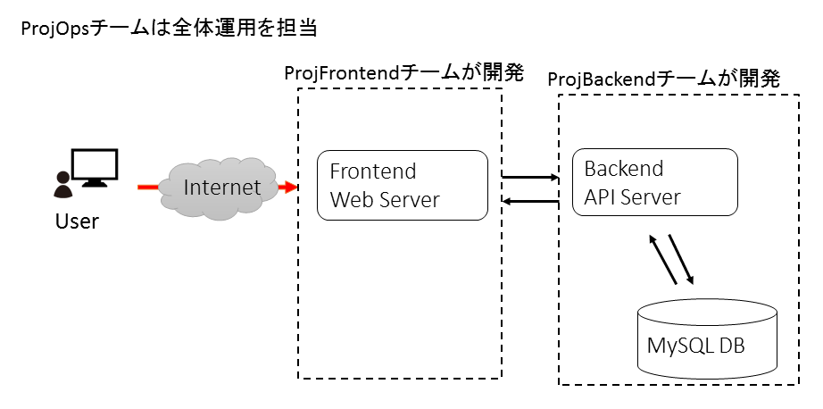

# Japan Container Days Meetup 2018年12月用ソースコード

## 概要

GitlabとIstioを使ったCICD Pipelineのサンプルです
上記のようなwebアプリで各開発チームと運用チームのGitLab CIのPipeline(.gitlab-ci.yml)の例を置いています。

## 使い方

installディレクトリを参考に環境を構築してください。
(TODO)

## Author

Shunsuke Miyoshi
